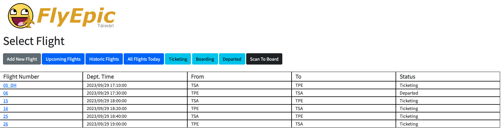
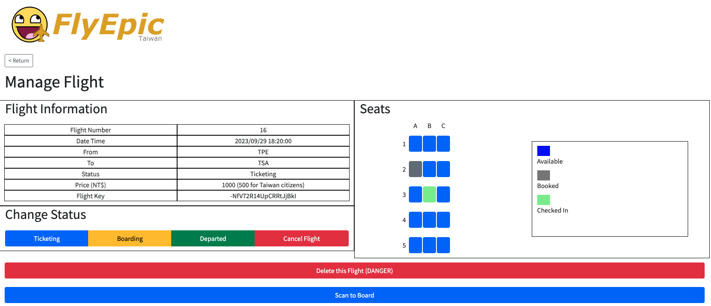
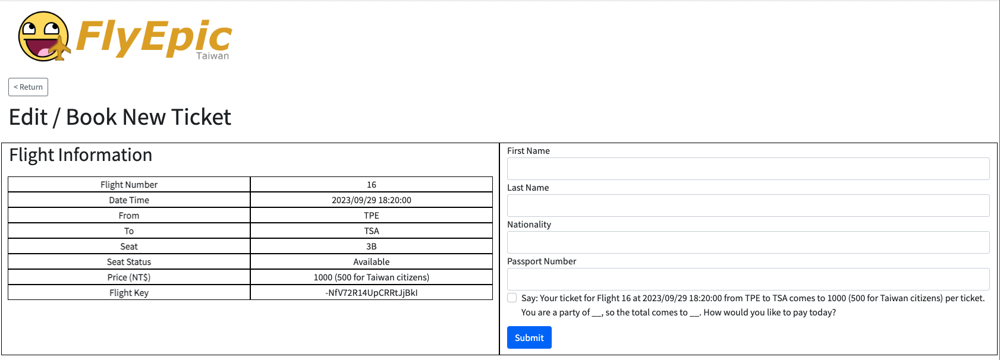
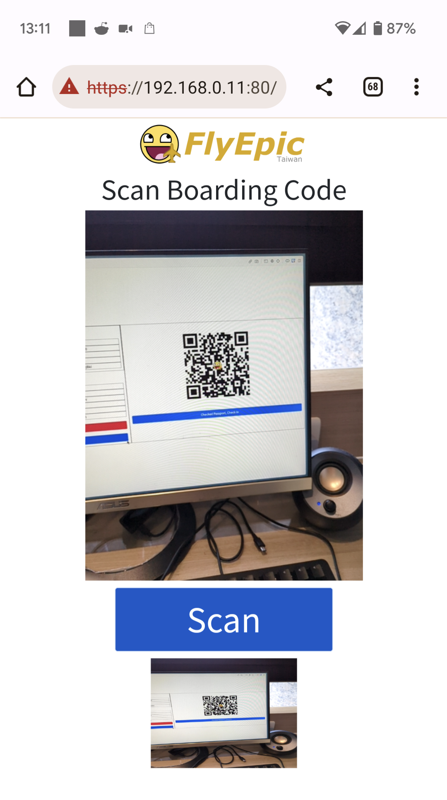

# FlyEpic Management

A simplified airline management system with flight management, booking, and check-in features.

## Tech Stack
- Flask
- Pyrebase4 (Firebase Realtime Database)
- Bootstrap 5
- jsQR (QR Code Scanner)

## Features
- Add flights to the database
- Specify the number of seats for each flight (columns and rows)
- Book seats individually
- Check-in for booked seats
- View flight details and seat status
- Generate a QR code for each seat for check-in (* https required)

## Direct Usage
1. Clone this repository
1. Create a venv environment and activate it
```bash
python -m venv venv
venv\Scripts\activate (Windows)
source venv/bin/activate (Linux)
```
3. Install dependencies
```bash
pip install -r requirements.txt
```
4. Run the app
```bash
python app.py
```
5. Open https://localhost

## Docker Usage
1. Clone this repository
1. Build the image
```bash
docker build -t flyepic .
```
3. Run the container
```bash
docker run -d -p 443:443 -p 80:80 flyepic
```
4. Open https://localhost

## Screenshots





